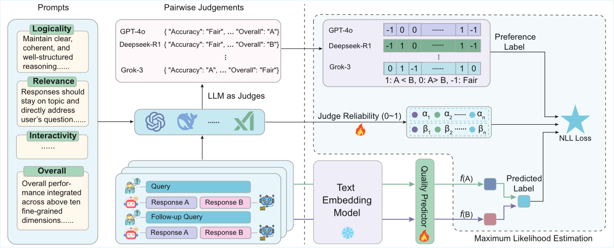

<div align="center">

<h1 align="center"> Learning an Efficient Multi-Turn Dialogue Evaluator from Multiple Judges  </h1>

<div align=center></div>

<p></p>
</div>

**MTDEval** is a lightweight open-source evaluator that can efficiently and flexibly evaluate multi-turn dialogues for both single rating and pairwise comparison tasks. Unlike traditional evaluators that suffer from various biases or incur significant computational overhead during inference, MTDEval captures the collective wisdom of multiple LLM judges by aggregating their preference knowledge into a single model. By leveraging a large-scale, multi-judge annotated preference dataset and employing a learning-to-rank framework, it provides reliable, interpretable, and fine-grained quality assessments. MTDEval’s robustness and applicability make it a valuable tool for advancing the evaluation and optimization of LLMs in diverse real-world dialogue scenarios.

<h3 id="3.1">🔧 Installation</h3>

First clone the repository:
```bash
git clone https://github.com/James-TYQ/MTDEval
```

Next, set up a conda environment:
```bash
conda create -n MTDEval python=3.10.9
conda activate MTDEval
```
Then, install the dependencies using pip:
```bash
pip install -r requirements.txt
```

<h3 id="3.2">⏩ Quickly Start </h3>
To train using MTDEval's data format, you need to first construct the training dataset according to the data format provided in the /data/P^2-MTD folder, and then use the commands in the overall and Multi_Dim folders as follows:

```bash
bash train_Multi.sh   # you can adjust some parameters in train_Multi.sh for better training performance
```

After obtaining the trained models, navigate to the corresponding directory for testing on the Daily-MTD dataset: for the single rating task, access the /Overall/test/single directory; for the pairwise comparison task, access the /Overall/test/pairwise directory; and for the Multi-Dimensional Comparison task, access the /Multi_Dim directory. Then, use the following command to evaluate:

```bash
python test.py
```

Users can also use MTDEvalPipeline for quick inference:

```python
from inference import MTDEvalPipeline

pipeline = MTDEvalPipeline(
    model_id="YOUR_MODEL_PATH",
    trust_remote_code=True,  
    torch_dtype=torch.float32  
)  # Initialize the pipeline with your model

chat_messages = [
    {"role": "user", "content": "What's the capital of France?"},
    {"role": "assistant", "content": "Paris is the capital of France."}
]

result = pipeline(chat_messages)
evaluation_dim = result['evaluation_dim']  # List of evaluated dimensions
overall_score = result['overall_score']  # Overall score
```

<h3 id="3.3">📜 Tips </h3>

1. The train data lie in the `data/P^2-MTD` directory, which contains 11,411 training examples (### Note: Due to submission file size limitations, we have included only 3,000 training examples in the submitted file ###).
2. Our newly released evaluation dataset is available at `data/Daily-MTD`, where `/data/Daily-MTD/Daily-MTD.csv` is for single rating task, `/data/Daily-MTD/Daily-MTD-Pair.csv`is for pairwise comparison task, and `/data/Daily-MTD/Daily-MTD-Dim.csv` is for multi-dimensional comparison task.
3. Please note that we support two distinct models in our experiments: one for overall rating, which can be trained using the train_Multi.sh script in the overall folder; and another for evaluating performance across ten specific dimensions, which can be trained using the train_Multi.sh script in the Multi_Dim folder.
4. test.py and inference.py are used together for model evaluation, and you can evaluate on your own multi-turn dialogue dataset in CSV format by following the structure used in test.py and inference.py.
